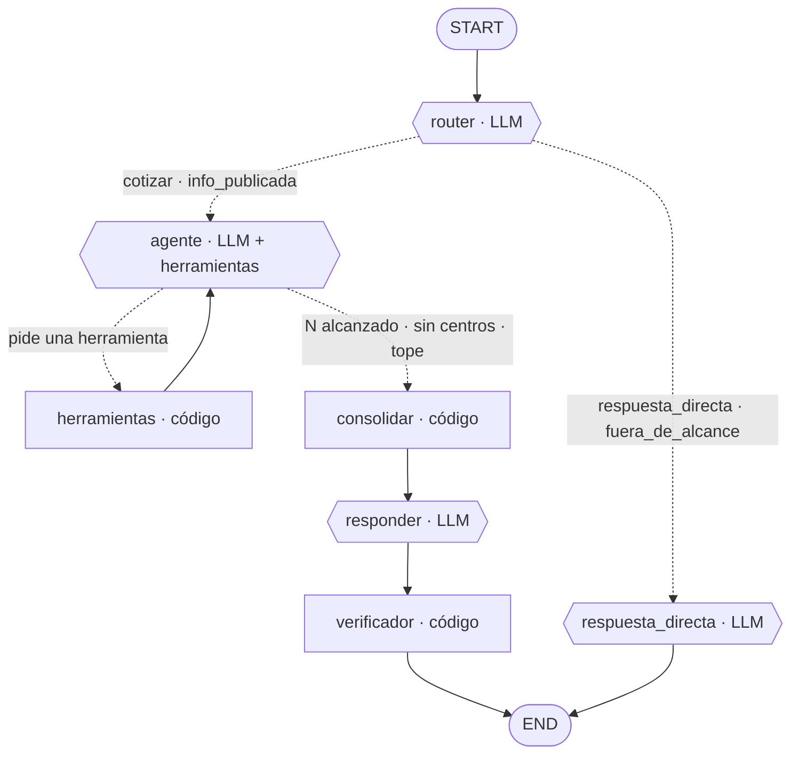

# Cotizador de exámenes médicos

Asistente que permite a una persona en Chile saber, en una sola consulta, **qué centros hacen el
examen que necesita, cuánto cuesta y cuándo hay hora**, sin llamar centro por centro. Interpreta la
necesidad en palabras propias, busca centros de la especialidad en la ciudad, identifica en cada
centro el examen que corresponde por su **propósito**, consulta los centros mediante **llamadas
simuladas** y presenta las opciones de forma comparable. **Informa, no decide**: no recomienda, no
agenda, no reserva y no pide ni envía datos personales.

V1 es un banco de pruebas: el agente, el RAG y el simulador son reales; los centros, sus documentos,
conversaciones, precios y agendas son simulados. La exactitud se mide **contra la verdad del
simulador**, no contra el mundo.

## ¿Qué hace? (resumen por componente)

- **Entiende** la consulta (`router`) y decide la ruta: cotizar, información publicada, respuesta
  directa o fuera de alcance.
- **Busca** centros de una especialidad en una ciudad leyendo un **web snapshot versionado**
  (`data/web_snapshots/`). Por defecto **no consulta la web**: la búsqueda en vivo está pendiente
  (DA-02) y aún no está implementada.
- **Revisa** los documentos de cada centro en Redis (RAG) para ver si ofrecen el examen.
- **Llama** por teléfono en una conversación simulada (el llamado lo dirige código; la recepcionista
  es un LLM) y **interpreta** la conversación en una cotización.
- **Consolida** un reporte comparable y **verifica** que no invente datos ni recomiende centros.

Recuerda, dentro de un mismo hilo, la **ciudad y la previsión** de turnos anteriores (RF-47), así que
no las vuelve a preguntar.

## Arquitectura del grafo

El diagrama siguiente refleja el grafo compilado (`main.py`). Se puede regenerar siempre:

```python
from main import app
print(app.get_graph().draw_mermaid())   # o draw_mermaid_png() para una imagen
```



### Nodos

| Nodo | Tipo | Qué hace |
|---|---|---|
| `router` | LLM (salida estructurada) | Clasifica en una de las 4 rutas y extrae **solo** necesidad, ciudad, previsión y N (nunca nombre, RUT ni diagnóstico). Usa el historial visible (mensajes del usuario y respuestas finales) y reinicia el estado del turno. |
| `respuesta_directa` | LLM | Responde saludos, "¿qué puedes hacer?", límites, pide datos faltantes (una sola vez la previsión) y deriva síntomas agudos. Va directo a `END`. |
| `agente` | LLM con herramientas | Ciclo **ReAct**: decide qué herramienta pedir y cuándo ya puede responder. |
| `herramientas` | código | Valida los argumentos, ejecuta y agrega observaciones, y cuenta las rondas. Las herramientas independientes de una misma ronda se ejecutan **en paralelo**. |
| `consolidar` | código | Arma el reporte (comparables, dudosos, descartados, trayectoria) y calcula el **motivo de parada**. No hay LLM aquí: el reporte no se redacta a mano. |
| `responder` | LLM | Redacta la respuesta final a partir del reporte. |
| `verificador` | código | Cada dato del reporte debe estar respaldado en una observación; el que no, pasa a "no confirmado". También retira recomendaciones del texto. |

### Conexiones

- `START → router`.
- `router → agente` cuando la ruta es `cotizar` o `info_publicada` (con datos completos).
- `router → respuesta_directa` para saludo, límite, fuera de alcance o datos faltantes.
- `agente ⇄ herramientas`: el bucle ReAct, acotado por `MAX_ITERACIONES` (10).
- `agente → consolidar` cuando ya tiene N comparables, no quedan centros o se alcanzó el tope.
- `consolidar → responder → verificador → END` (la única cadena que redacta el reporte).

## Herramientas (las únicas que ve el LLM)

| Herramienta | Entrada | Qué hace |
|---|---|---|
| `buscar_centros` | `especialidad`, `ciudad` | Lee el web snapshot versionado del escenario (modo `web_snapshot`, el único implementado); **no consulta la web**. Valida que la ciudad sea de Chile, devuelve hasta K centros y detecta instrucciones inyectadas en los fragmentos del web snapshot. Si la ciudad pedida no es la del web snapshot, devuelve 0 centros. |
| `identificar_examen` | `centro_id`, `necesidad` | Con la lista de exámenes del centro (ingesta) + un LLM, decide: `coincide`, `dudoso`, `no_coincide` o `sin_documento`. |
| `consultar_centro` | `centro_id`, `codigo_examen` | Ejecuta la llamada simulada (código + recepcionista LLM) e interpreta la conversación en una `Cotizacion`. No se consulta si ya hay N comparables ni a centros dudosos/no coincidentes. |
| `consultar_documentos` | `centro_id`, `consulta`, `codigo_examen?` | RAG sobre Redis: recupera fragmentos publicados del centro para preparación, requisitos o días de atención. No entrega precios. |

## Subagentes LLM especializados

| Subagente | Dónde | Qué hace |
|---|---|---|
| Identificador | `tools/identificar_examen.py` | Elige, para un centro, cuál de sus exámenes corresponde a la necesidad. |
| Recepcionista | `agents/recepcionista.py` | Responde **un turno** de la llamada, usando solo sus fragmentos, su agenda y sus eventos. Un validador de fidelidad exige que cada precio/hora exista en su fuente. |
| Interpretador | `agents/interpretador_cotizacion.py` | Convierte la transcripción de la llamada en una `Cotizacion`, validando que cada valor aparezca en la transcripción. |

## El recorrido de una consulta, paso a paso

Ejemplo: *"Necesito un fondo de ojo en Talca, Fonasa"*.

1. **Entiende la consulta** — el router clasifica `cotizar` y extrae necesidad, ciudad y previsión.
2. **Busca centros** — `buscar_centros("oftalmología", "Talca")` devuelve los centros del web snapshot.
3. **Revisa documentos** — para cada centro, `identificar_examen` decide si hacen el examen.
4. **Llama a los centros** — `consultar_centro` simula la llamada (diálogo llamador/recepción) y
   registra precio, modalidad, próxima hora y preparación.
5. **Consolida** — se arma el reporte con comparables, dudosos y descartados, y el motivo de parada.
6. **Responde y verifica** — el LLM redacta y el verificador marca "no confirmado" lo no respaldado.

El notebook `notebooks/prueba_cotizador.ipynb` imprime este recorrido de principio a fin.

## Instalación

### macOS / Linux

```bash
python3 --version
python3 -m venv .venv
source .venv/bin/activate
pip install -r requirements.txt
```

### Windows

```powershell
python.exe --version
python.exe -m venv .venv
.venv\Scripts\activate
pip install -r requirements.txt
```

## Configuración

Copia `.env.example` a `.env` y completa tus credenciales (el `.env` nunca se sube al repositorio):

```
OPENAI_API_KEY=...            # credencial de OpenAI (embeddings y, si se elige, el LLM)
OPENCODE_API_KEY=...          # credencial de OpenCode Zen (LLM)
LLM_MODELO_AGENTE=opencode:deepseek-v4.1-flash   # "openai:<modelo>" u "opencode:<modelo>"
OPENAI_EMBEDDINGS_MODEL=text-embedding-3-small   # genera 768 dimensiones
REDIS_URL=...                 # Redis del curso (vector store)
BUSQUEDA_API_KEY=             # opcional: reservada para el modo en vivo (DA-02, aún no implementado)
```

`config.py` es el **único** módulo que lee el `.env`.

### Ficha del modelo y parámetros

| Parámetro | Valor | Dónde |
|---|---|---|
| `PROVEEDOR_LLM` / `MODELO_LLM` | `LLM_MODELO_AGENTE` del `.env` (`openai` u `opencode`) | `config.py` |
| `MODELO_EMBEDDINGS` | `OPENAI_EMBEDDINGS_MODEL` del `.env` | `config.py` |
| `TEMPERATURA_AGENTE` / `TEMPERATURA_RECEPCIONISTA` | 0,0 / 0,1 | `config.py` |
| `LLM_TIMEOUT_S` | 90,0 s (corta una llamada colgada) | `config.py` |
| `LLM_MAX_REINTENTOS` | 1 (reintentos del cliente LLM) | `config.py` |
| `N_POR_DEFECTO` | 2 | `config.py` |
| `K_MAX_CENTROS` | 6 | `config.py` |
| `MAX_ITERACIONES` | 10 | `config.py` |
| `BUSQUEDA_MODO` | `web_snapshot` (por defecto; único implementado) · `en_vivo` (pendiente, DA-02) | `config.py` |
| `ESCENARIO_POR_DEFECTO` | `default` | `config.py` |
| `INDICE_CENTROS` | `cotizador_centros_v1` (prefijo `cotizador:frag`) | `config.py` |

La condición de parada y el tope están en `main.py` (`despues_agente`) y en
`tools/consultar_centro.py` (no se consulta si ya hay N comparables).

## Ejecución

### Consola

1. Cargar los documentos en el Redis del curso (una vez; es idempotente):

   ```bash
   python scripts/ingesta.py
   ```

2. Conversar con el agente:

   ```bash
   python main.py
   ```

### Notebooks

- `notebooks/prueba_cotizador.ipynb` — **notebook de entrega**, una sola celda: corre una conversación de
  varios turnos en el mismo hilo. **La ingesta de documentos y el RAG se preparan solos** (solo si
  hace falta), así que basta con tener Redis accesible.

La lógica compartida de la demostración vive en `notebooks/recorrido_demo.py`.

## Datos de prueba

Todo dato de prueba está versionado en `data/` y **se carga, no se genera** durante la ejecución:

* `data/documentos/*.pdf` — un PDF por centro (incluye un centro de oncología en Santiago).
* `data/revision_documentos.md` — revisión manual de cada documento (A1) y unión teléfono ↔ documento (A2).
* `data/web_snapshots/` — web snapshots de búsqueda (una normal y una con inyección de prueba).
* `data/eventos.json` — los seis eventos de conversación.
* `data/escenarios/` — escenarios (`default`, `no_contesta`, `cortada_y_suspendido`, `agenda`,
  `intenta_agendar`, `inyeccion`). Reglas de combinación y horas revisadas en `data/revision_escenarios.md`.
* `data/ciudades_chile.json` — lista versionada de ciudades de Chile.

Los scripts `scripts/generar_documentos.py` y `scripts/capturar_web_snapshot.py` son **solo de
desarrollo**.

## Evaluación

* `validacion/golden_set.json` (G01–G16) y `validacion/seguridad.json` (S1–S6).
* `validacion/run_golden.py` y `validacion/run_seguridad.py` ejecutan el agente con
  `astream(..., stream_mode="updates")` y comparan contra lo esperado.
* `validacion/resultados_{fecha}.xlsx` con las hojas `Detalle`, `Resumen` y `Fallos`.

## Estructura

```
cotizador-examenes/
├── main.py              grafo START → END (sin lógica de negocio)
├── config.py            .env + parámetros centralizados (único lector del entorno)
├── state.py             estado compartido del grafo
├── schemas.py           modelos de dominio (Pydantic)
├── nodes/               router, respuesta_directa, agente, herramientas, consolidar, responder, verificador
├── tools/               las 4 herramientas del agente
├── agents/              identificador, interpretador, recepcionista
├── services/            llm, embeddings, redis_store, ingesta, busqueda, simulador, ciudades, privacidad, sintomas
├── prompts/             un prompt por llamada al LLM + seguridad.py
├── data/                datos de prueba versionados
├── validacion/          golden set y pruebas de seguridad
├── notebooks/           prueba_cotizador.ipynb y recorrido_demo.py
└── scripts/             herramientas de desarrollo e ingesta
```
